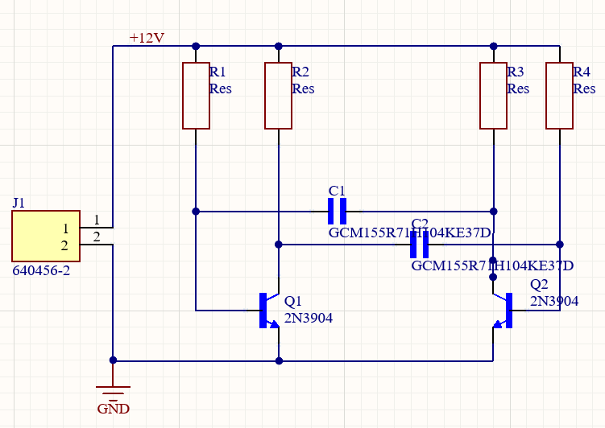
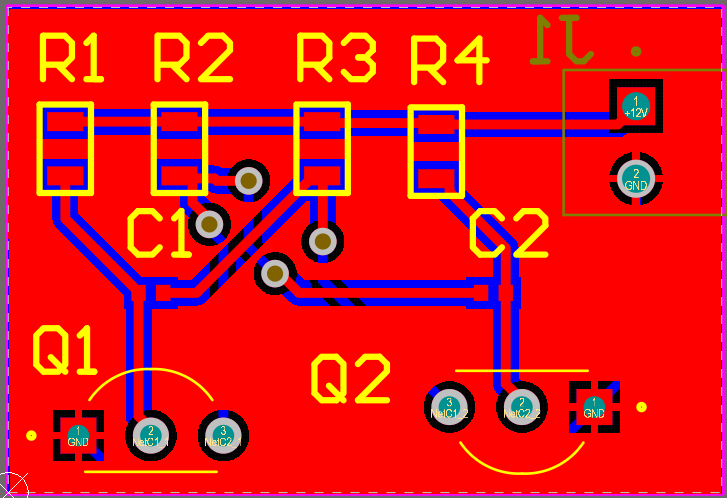
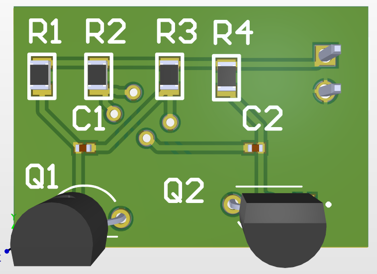
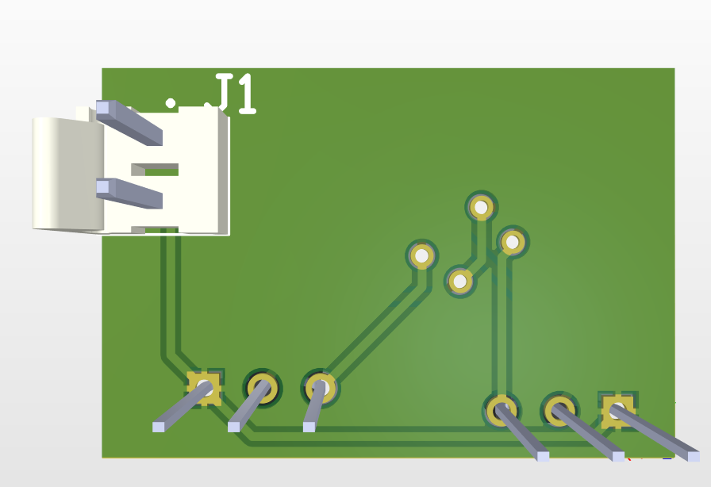
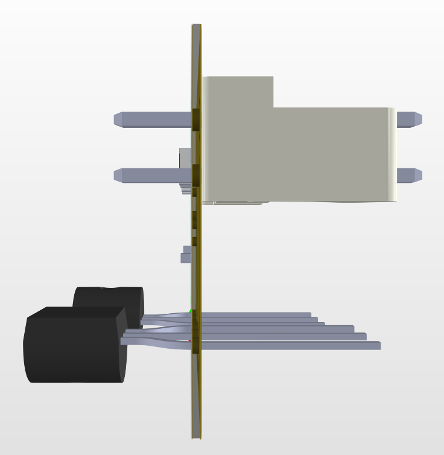

# practica
# Проект мультивібратора в Altium Designer

Цей репозиторій містить файли проекту мультивібратора, який був розроблений в ПЗ **Altium Designer**

---

## Про автора
* **Ім'я** Розпутній Дмитро
* **Група** Б-171-23-1ЕС
* **Університет** Київський Авіаційний Інститут

---

## Опис проекту

Мульти вібратор- електронний генератор прямокутних імпульсів. У цьому проекті був реалізований **астабільний мультивібратор**, який є ключовим у багатьох електронних пристроях.
проект включає в себе
* Електрично принципову схему(Schematic)
* Розробку другоманої плати(PCB Layout)
* 3D-модель плати.

---

## Необхідне середовище
* Altium Designer 20 або новіше

---

## Компоненти
* 2х NPN транзистори (2N3904)
* 2x резистори для бази (CRG0805F33R)
* 2x резистори для навантаження (CRG0805F33R)
* Живлення 12V

---

## Результати

### Принципова схема

*Принципова схема мультивібратора в Altium Designer*
### Розміщення компонентів на платі та трасування

*Розміщення компонентів на платі та трасування доріжок в Altium Designer*
### 3D-модель плати

*3D-модель плати мультивібратора в Altium Designer*